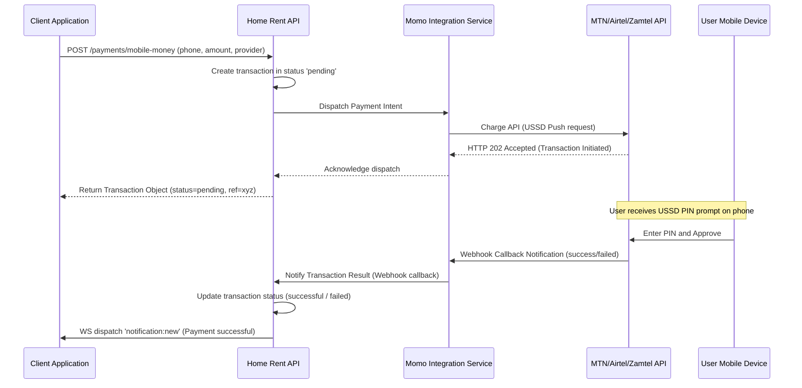

# HOME RENT API SPECIFICATION & ARCHITECTURE

Version: 1.0
OpenAPI Spec File: [openapi.yaml](file:///home/felix/Myprojects/home-rent/home-rent-api/openapi.yaml)

Base URL:
```http
https://api.homerent.zm/api/v1
```

Authentication:
```http
Authorization: Bearer {token}
```

---

## 1. GLOBAL STANDARDS

### 1.1 Error Handling Standard (RFC 7807)
All error responses from the API must conform to the **Problem Details for HTTP APIs (RFC 7807)** specification. This ensures consistent error formats across all micro-services and sub-modules.

Example Error Response (`400 Bad Request`):
```json
{
  "type": "https://api.homerent.zm/errors/validation-failed",
  "title": "Validation Failed",
  "status": 400,
  "detail": "The phone field does not match the required Zambia format pattern.",
  "instance": "/api/v1/auth/register",
  "invalid_params": [
    {
      "name": "phone",
      "reason": "must be in format +2609XXXXXXXX"
    }
  ]
}
```

### 1.2 Pagination Standards
For endpoints returning collections (e.g., searches, lists), two models are supported:

1. **Offset-Based Pagination** (Default for general search and administration logs):
   - Query Parameters: `page` (default 1), `limit` (default 20, max 100).
   - Response envelope:
     ```json
     {
       "data": [...],
       "pagination": {
         "page": 1,
         "limit": 20,
         "total": 120
       }
     }
     ```

2. **Cursor-Based Pagination** (Required for high-frequency feeds, chat messages, and notification timelines to avoid skip/duplicate issues):
   - Query Parameters: `limit` (default 50), `before_id` (returns items preceding this ID), `after_id` (returns items succeeding this ID).
   - Response envelope:
     ```json
     {
       "data": [...],
       "pagination": {
         "has_more": true,
         "next_cursor": "msg_890123"
       }
     }
     ```

### 1.3 RBAC Permissions Matrix
Roles on the platform:
- `tenant`: Browse properties, create inquiries, viewings, bookings, chat, and submit tenant verification.
- `landlord`: Manage own listings, view booking requests, generate leases, verify landlord documents, check payments.
- `agent`: Manage listings under agency, CRM lead tools, task tracker, schedule meetings, verify agent credentials.
- `moderator`: Approve or reject properties, review content reports, manage classifications.
- `admin`: Full system control, role modifications, system settings, financial analytics, indexing triggers.

| Route Pattern | Tenant | Landlord | Agent | Moderator | Admin |
| :--- | :---: | :---: | :---: | :---: | :---: |
| `/auth/**` (Public) | Yes | Yes | Yes | Yes | Yes |
| `GET /properties` (Public) | Yes | Yes | Yes | Yes | Yes |
| `POST /properties` | No | Yes | Yes | No | Yes |
| `PATCH /properties/{id}/status` | No | Owner | Owner | Yes | Yes |
| `/favorites/**` | Yes | Yes | Yes | Yes | Yes |
| `/inquiries/**` | Yes | Owner | Owner | No | Yes |
| `/viewings/**` | Yes | Owner | Owner | No | Yes |
| `/bookings/**` | Yes | Owner | Owner | No | Yes |
| `POST /payments/mobile-money` | Yes | Yes | Yes | No | Yes |
| `/crm/**` | No | No | Yes | No | Yes |
| `/admin/**` | No | No | No | Partial | Yes |
| `POST /search-index/reindex` | No | No | No | No | Yes |

---

## 2. REAL-TIME COMMUNICATION (WEBSOCKETS)

### 2.1 Protocol and Endpoint
The real-time notification and chat functionality uses WebSockets at:
```http
GET /api/v1/ws/connect?token={jwt_token}
```
Clients must authenticate by providing the JWT token as a query parameter.

### 2.2 Event Frame Structure
All frames exchanged must be in text-based JSON format:
```json
{
  "event": "event_name",
  "payload": { ... }
}
```

#### Supported Downstream (Server -> Client) Events:
- `message:new`: Dispatched when a new message is received in a conversation.
  ```json
  {
    "event": "message:new",
    "payload": {
      "id": "msg_901",
      "conversation_id": "conv_123",
      "sender_id": "usr_abc",
      "content": "Hi, can I check this house tomorrow?",
      "created_at": "2026-06-08T17:55:00Z"
    }
  }
  ```
- `message:typing`: Indicates a user is typing in a conversation.
- `message:read`: Real-time read receipts.
- `notification:new`: Real-time push notification for bookings, viewing confirmations, or system alerts.

#### Supported Upstream (Client -> Server) Events:
- `message:send`: Sends a message to a conversation.
  ```json
  {
    "event": "message:send",
    "payload": {
      "conversation_id": "conv_123",
      "content": "Sure, 10 AM works!"
    }
  }
  ```
- `message:typing_start` / `message:typing_stop`: Broadcasts typing status.

---

## 3. MOBILE MONEY INTEGRATION WORKFLOW

Integration with Zambian Mobile Money networks (**MTN**, **Airtel**, **Zamtel**) is designed around an asynchronous, multi-step transaction pattern.



### 3.1 Network-Specific Endpoints
- **MTN MoMo Sandbox/Prod API**: We connect to `https://sandbox.momodeveloper.mtn.com` / `https://partner.api.mtn.com`.
- **Airtel Money Merchant API**: We integrate using the Airtel Open API schema.
- **Zamtel Kwacha API**: Uses standard SOAP/REST XML gateway integration.

Callback verification requires calculating and checking the `X-Signature` header against the payload using HMAC-SHA256 with the shared integration secret.

---

## 4. ENDPOINT REFERENCE


# AUTHENTICATION

## Register User

### Endpoint

```http
POST /auth/register
```

### Request

```json
{
  "first_name": "Felix",
  "last_name": "Simpemba",
  "email": "felix@example.com",
  "phone": "+260977123456",
  "password": "Password@123",
  "account_type": "tenant"
}
```

### Response

```json
{
  "success": true,
  "message": "Registration successful",
  "data": {
    "user_id": "usr_12345",
    "verification_required": true
  }
}
```

---

## Login

### Endpoint

```http
POST /auth/login
```

### Request

```json
{
  "email": "felix@example.com",
  "password": "Password@123"
}
```

### Response

```json
{
  "success": true,
  "token": "jwt_token",
  "refresh_token": "refresh_token",
  "user": {
    "id": "usr_12345",
    "role": "tenant"
  }
}
```

---

## Forgot Password

```http
POST /auth/forgot-password
```

### Request

```json
{
  "email": "felix@example.com"
}
```

---

## Reset Password

```http
POST /auth/reset-password
```

### Request

```json
{
  "token": "reset-token",
  "password": "NewPassword@123"
}
```

---

# USERS

## Get Current User

```http
GET /users/me
```

### Response

```json
{
  "id": "usr_12345",
  "first_name": "Felix",
  "last_name": "Simpemba",
  "email": "felix@example.com",
  "role": "tenant"
}
```

---

## Update Profile

```http
PUT /users/me
```

### Request

```json
{
  "first_name": "Felix",
  "last_name": "Simpemba",
  "phone": "+260977123456",
  "bio": "Software Developer"
}
```

---

# PROPERTIES

## Create Property

```http
POST /properties
```

### Request

```json
{
  "title": "3 Bedroom House",
  "description": "Beautiful family house",
  "property_type": "house",
  "listing_type": "rent",
  "price": 4500,
  "deposit": 4500,
  "bedrooms": 3,
  "bathrooms": 2,
  "parking_spaces": 2,
  "province": "Lusaka",
  "district": "Lusaka",
  "area": "Ibex Hill",
  "latitude": -15.4067,
  "longitude": 28.2871,
  "amenities": [
    "water",
    "electricity",
    "borehole"
  ]
}
```

### Response

```json
{
  "success": true,
  "property_id": "prop_123456"
}
```

---

## Upload Property Images

```http
POST /properties/{propertyId}/images
```

### Multipart Form Data

```text
images[]
```

### Response

```json
{
  "success": true,
  "images": [
    {
      "id": "img_1",
      "url": "https://cdn.site.com/img1.jpg"
    }
  ]
}
```

---

## Update Property

```http
PUT /properties/{propertyId}
```

### Request

```json
{
  "price": 5000,
  "description": "Updated description"
}
```

---

## Delete Property

```http
DELETE /properties/{propertyId}
```

### Response

```json
{
  "success": true
}
```

---

## Get Property

```http
GET /properties/{propertyId}
```

### Response

```json
{
  "id": "prop_123",
  "title": "3 Bedroom House",
  "price": 4500,
  "bedrooms": 3,
  "bathrooms": 2,
  "images": [],
  "owner": {
    "id": "usr_123",
    "name": "John Doe"
  }
}
```

---

## Search Properties

```http
GET /properties
```

### Query Parameters

```text
?page=1
&limit=20
&listing_type=rent
&province=Lusaka
&area=Ibex Hill
&min_price=1000
&max_price=10000
&bedrooms=3
```

### Response

```json
{
  "data": [],
  "pagination": {
    "page": 1,
    "total": 100
  }
}
```

---

# FAVORITES

## Add Favorite

```http
POST /favorites
```

### Request

```json
{
  "property_id": "prop_123"
}
```

---

## Remove Favorite

```http
DELETE /favorites/{propertyId}
```

---

## Get Favorites

```http
GET /favorites
```

---

# INQUIRIES

## Create Inquiry

```http
POST /inquiries
```

### Request

```json
{
  "property_id": "prop_123",
  "message": "Is this house still available?"
}
```

### Response

```json
{
  "success": true,
  "inquiry_id": "inq_123"
}
```

---

## Get My Inquiries

```http
GET /inquiries
```

---

## Get Inquiry

```http
GET /inquiries/{id}
```

---

## Close Inquiry

```http
PATCH /inquiries/{id}/close
```

---

# VIEWINGS

## Request Viewing

```http
POST /viewings
```

### Request

```json
{
  "property_id": "prop_123",
  "date": "2026-06-15",
  "time": "10:00",
  "message": "Interested in viewing"
}
```

---

## Approve Viewing

```http
PATCH /viewings/{id}/approve
```

---

## Reject Viewing

```http
PATCH /viewings/{id}/reject
```

### Request

```json
{
  "reason": "Already booked"
}
```

---

## Reschedule Viewing

```http
PATCH /viewings/{id}/reschedule
```

### Request

```json
{
  "date": "2026-06-16",
  "time": "14:00"
}
```

---

# MESSAGING

## Get Conversations

```http
GET /conversations
```

---

## Send Message

```http
POST /messages
```

### Request

```json
{
  "conversation_id": "conv_123",
  "message": "Hello, is the property still available?"
}
```

---

## Get Conversation Messages

```http
GET /conversations/{id}/messages
```

---

# LANDLORD VERIFICATION

## Submit Verification

```http
POST /verification/landlord
```

### Request

```json
{
  "nrc_number": "123456/12/1",
  "selfie_url": "https://cdn.site.com/selfie.jpg"
}
```

---

# AGENT VERIFICATION

## Submit Agent Verification

```http
POST /verification/agent
```

### Request

```json
{
  "agency_name": "Feltech Properties",
  "license_number": "LIC123456",
  "tax_number": "TPIN123456"
}
```

---

# PAYMENTS

## Create Subscription

```http
POST /subscriptions
```

### Request

```json
{
  "plan": "premium",
  "payment_method": "mtn_momo"
}
```

---

## Initiate Mobile Money Payment

```http
POST /payments/mobile-money
```

### Request

```json
{
  "provider": "mtn",
  "phone_number": "+260977123456",
  "amount": 250
}
```

---

# NOTIFICATIONS

## Get Notifications

```http
GET /notifications
```

---

## Mark Notification Read

```http
PATCH /notifications/{id}/read
```

---

# ADMIN

## Get Users

```http
GET /admin/users
```

---

## Verify Agent

```http
PATCH /admin/agents/{id}/verify
```

---

## Approve Property

```http
PATCH /admin/properties/{id}/approve
```

---

## Reject Property

```http
PATCH /admin/properties/{id}/reject
```

### Request

```json
{
  "reason": "Insufficient information"
}
```

---

## Dashboard Statistics

```http
GET /admin/dashboard
```

### Response

```json
{
  "users": 1200,
  "properties": 450,
  "active_listings": 300,
  "subscriptions": 120
}
```
